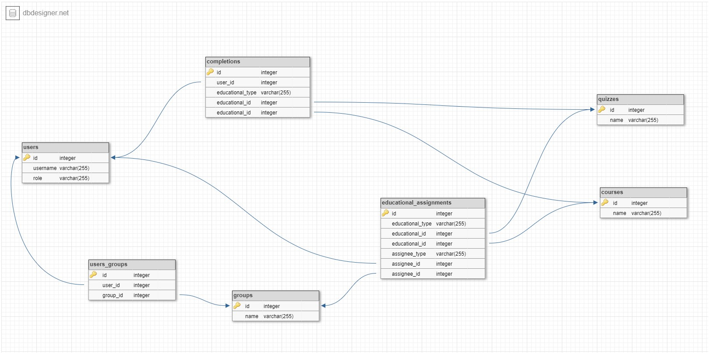

# Тестовое задание

#### Ruby version

Версия `Ruby 2.7.0`

#### Установка и запуск приложения

1. Скопируйте репозиторий

```
$ git clone git@github.com:Lemeri02/curriculum-test.git
```

2. Запустите команду `bundle`
```
$ bundle
```
3. Запустите миграции
```
$ rails db:migrate
```

4. Добавляем демо данные в базу данных
```
$ rails db:seed
```

В БД будет добавлены: пользователи, группа с пользователями, курс, тест.

_см. `db/seeds.rb`_

5. Запустите консоль
```
$ rails c
```
---
Схема БД


